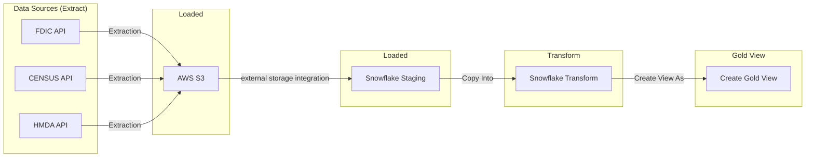

# Welcome to the Bank Redline Project
Thank you for checking out my github and this project. This project was inspired by using Snowflake at work and I wanted to get my hands dirty with some data engineering with Snowflake. 

## About the project
I really wanted to find out if there is any redlining from banks in the south east using FDIC and Census data. I am still researching the other data sources because to really find out if redlining is happening is to get loan counts and amounts to incorporate with this analysis which is why im using HMDA data for home loands. This being said im still looking at other data sources so this is an on going project and see if I have a story to tell.  

### Tools 
One reason i like answering these questions is that it is an opportunity to learn new tools of the trade for data engineering and analytics. The tools used for this is  
- Python
- Amazon S3
- Snowflake (External Storage Integrations, Stored Procedures, Tasks)
- Github Actions
- Tableau 

### Architecture 

Data is ingest via a python scrpit that pulls and loads into an Amazon S3 Bucket. From there Snowflake's external storage integration is configured to read the S3 bucket and ingested into the staging area. From there those files are copied into a staging table then merged into a dimension table. The raw data is scheduled via GitHub Actions and then once it lands into the S3 bucket then Snowflake stored procedures and tasks to ingest the data into the dimension tables. From there a view is created for our gold/analytics layer

### Deliverable 
**[Tableau Dashboard](https://public.tableau.com/app/profile/jeremy.mccormick/viz/bank_redline/Dashboard1#1)**

### Data Sources

All the API config (endpoints, states, fields, params) lives in `config.yml` so nothing is hardcoded in the extract scripts.

**[FDIC BankFind Suite API](https://banks.data.fdic.gov/docs/)** — pulls bank location data (name, address, city, county, lat/long, cert number, etc.) for the southeast states: AL, FL, GA, LA, MS, NC, SC, TN.

**[Census ACS 5-Year Data Profile API](https://www.census.gov/data/developers/data-sets/acs-5year.html) (2022)** — county-level population and household income data (`DP05_0001E`, `DP03_0062E`) for the southeast footprint: AL, FL, GA, LA, MS, NC, SC, TN. Pulled at the county level (`county:*`).

**[HMDA Data Browser API](https://ffiec.cfpb.gov/documentation/api/data-browser/)** — loan-level data from the CFPB for 2024, filtered to home purchase loans (loan purpose = 1), across AL, FL, GA, LA, MS, NC, SC, TN. This is the piece I'm still working through since it's key to actually measuring loan counts/amounts against the FDIC and Census data.

Raw pulls from all three sources land in an S3 bucket (`bank-snowflake-project`) before getting picked up by Snowflake's external storage integration.


### Project Directory
```
├── config.yml <- containing API's, query params, AWS buckets
├── data <- folder for raw data exports
├── etl <-scripts for extracting from api and loading to s3
│ ├── extract.py
│ └── load.py
├── main.py <- run etl (technically EL)
├── README.md <- this file
├── requirements.txt <-dependencies for this file
├── sql <- sql queries for the transforming the loaded data
│ ├── census
│ │ ├── census_stage.sql
│ │ ├── dim_county_census_stats.sql
│ │ └── stg_county_data.sql
│ ├── fdic
│ │ ├── create_stage.sql
│ │ ├── load_s3_stg_se_banks.sql
│ │ ├── merge_stg_to_dim_banks.sql
│ │ ├── storage_integration.sql
│ │ └── tasks.sql
│ ├── gold
│ │ └── mart_bank_redline.sql
│ └── hmda
│ ├── copy_into.sql
│ ├── create_stage.sql
│ └── create_table.sql
└── static_main.py <- static data used for uploading to s3

```

## Contact

**Jeremy McCormick** — Data Engineer  
JeremyAlanMcCormick@gmail.com  

- [LinkedIn](https://www.linkedin.com/in/jeremyalanmccormick/)
- [GitHub](https://github.com/SpotMcCormick)